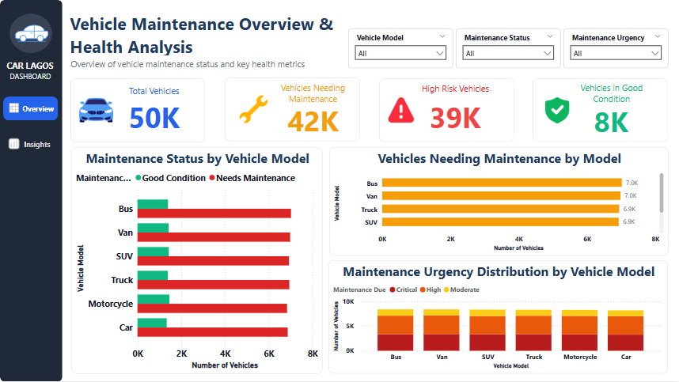
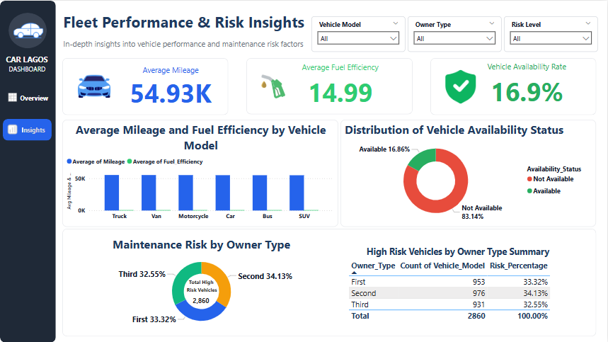

# Predictive Vehicle Maintenance

## Project Overview

This project analyzes vehicle maintenance data for a car rental company to understand maintenance patterns and identify factors associated with vehicle maintenance needs.

The project covers exploratory data analysis, data preparation, SQL analysis, machine learning, and Power BI visualization.

## Objectives

- Explore vehicle data and identify patterns related to maintenance.
- Clean and prepare the dataset for analysis and prediction.
- Use SQL to analyze vehicle and maintenance data.
- Develop a machine learning model to predict potential maintenance needs.
- Create a Power BI dashboard to present key findings and insights.

## Tools & Technologies

- Python
- Pandas
- NumPy
- Matplotlib
- Seaborn
- SQL
- Power BI
- Scikit-learn

## Project Files

| File | Description |
|---|---|
| `Vehicle maintenance analysis eda` | Exploratory data analysis and visualization |
| `Maintenance prediction ml` | Machine learning analysis and maintenance prediction |
| `Vehicle maintenance cleaned full csv` | Cleaned dataset used for analysis |
| `Vehicle maintenance readable full csv` | Readable version of the dataset |
| `Car rental sql` | SQL queries and analytical views |
| `Car dashboard` | Power BI dashboard presenting key insights |

## Key Areas of Analysis

The analysis focuses on vehicle characteristics, usage patterns, maintenance history, and other factors that may be associated with vehicle maintenance needs.

## Project Outcome

The project combines data analysis, SQL, machine learning, and visualization to understand vehicle maintenance patterns and support proactive maintenance decisions.

## Dashboard Preview

### Dashboard Page 1

### Dashboard Page 2

